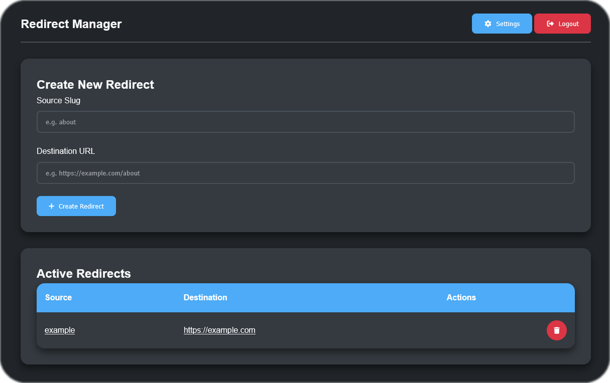

# PyDirect

PyDirect is a Flask-based redirect management application. It allows you to create and manage URL redirects through an admin panel. The application supports user authentication, dark mode preference, and persistent settings.

## Features

- **Create Redirects:** Add new redirects from a source path to a destination URL.
- **Manage Redirects:** View and delete active redirects.
- **Dark Mode:** Toggle dark mode for a modern look.

## Running the Application with Docker

A Docker image for PyDirect is available at [ghcr.io/thebiemgamer/pydirect:latest](https://ghcr.io/thebiemgamer/pydirect:latest).

To run the application with Docker, use the following command:

```bash
docker run -p 5000:5000 ghcr.io/thebiemgamer/pydirect:latest
```

You can now access the admin panel at `http://localhost:5000/admin`.

## How It Works

1. **Authentication:**  
   - Users must log in to access the admin panel.
   - A default user is created if no user exists. By default, the credentials are:
     - **Username:** admin
     - **Password:** admin  
     *(Change these credentials for production use.)*

2. **Admin Panel:**  
   - Create new redirects by providing a source path and destination URL.
   - View active redirects in a table.
   - Delete redirects using the delete button.

3. **Settings:**  
   - Update your username, password, and dark mode preference.
   - The application saves changes to the database.

4. **Dynamic Redirect:**  
   - Any URL path that matches a stored redirect will automatically redirect to the destination URL.

## Requirements

- Python 3.9 or later
- Flask
- Flask-Login
- Flask-SQLAlchemy
- Gunicorn (for production use)
- Docker (optional, for containerized deployment)

## Getting Started Locally

1. **Clone the Repository:**

   ```bash
   git clone https://github.com/thebiemgamer/PyDirect.git
   cd PyDirect
   ```

2. **Set Up a Virtual Environment:**

   ```bash
   python -m venv venv
   source venv/bin/activate   # On Windows: venv\Scripts\activate
   ```

3. **Install Dependencies:**

   ```bash
   pip install -r requirements.txt
   ```

4. **Run the Application:**

   ```bash
   python app.py
   ```

   You can now access the admin panel at `http://localhost:5000/admin`.